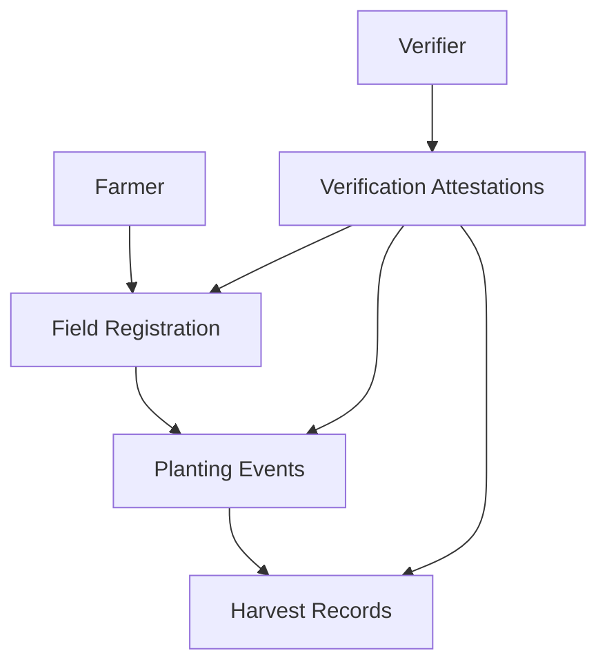

# Fuzzy Review: Transparent Agricultural Yield Tracking

## Overview

Fuzzy Review is an innovative blockchain-based platform that provides transparent, verifiable tracking of agricultural yields using the Stacks blockchain. By leveraging decentralized technology, we create an immutable and trustworthy record of agricultural production.

## Key Features

- 🌱 Comprehensive field and crop tracking
- 🔍 Third-party verification mechanisms
- 🔐 Granular access control
- 📊 Transparent supply chain insights

## Problem Statement

Agricultural data has traditionally been fragmented, opaque, and difficult to verify. Fuzzy Review solves this by:

- Creating an immutable record of agricultural activities
- Enabling trust through verifiable data
- Reducing information asymmetry in agricultural supply chains

## System Architecture



## Getting Started

### Prerequisites
- Clarinet
- Stacks wallet
- Basic understanding of blockchain technologies

### Installation
1. Clone the repository
2. Install dependencies: `clarinet install`
3. Run tests: `clarinet test`
4. Deploy: `clarinet deploy`

## Usage Examples

### Register a Farmer
```clarity
(contract-call? .fuzzy-yield-tracker register-farmer "Emma Green" "California, USA")
```

### Register a Field
```clarity
(contract-call? .fuzzy-yield-tracker register-field "Sunflower Valley" u50 "Rich Loam")
```

## Security Considerations

- Strict access control
- Immutable verification records
- Granular data permissions
- Input validation

## Contributing

1. Fork the repository
2. Create a feature branch
3. Commit your changes
4. Push and create a pull request

## License

[Insert appropriate license]